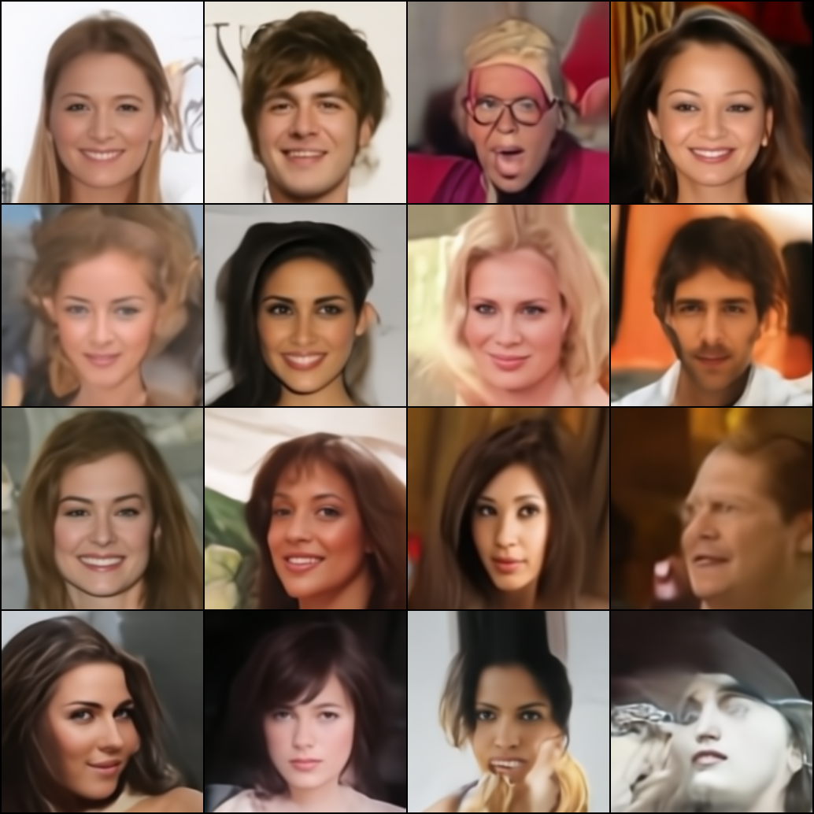

# A Minimal Latent Diffusion Model (LDM)

This project implements a latent diffusion model for image generation using PyTorch and the `diffusers` library.
It first pretrains an autoencoder to compress image to latent space, then perform diffusion in the latent space, which can be more efficient than pixel space.



## Dependencies
You can install these dependencies using pip:

```bash
pip install torch torchvision diffusers tqdm
```

## Usage

### Download the dataset
Download celeba images from [Google Drive](https://drive.google.com/uc?id=0B7EVK8r0v71pZjFTYXZWM3FlRnM), and extract them to a directory. Please note that the images should be placed in `<DATA_ROOT>/<sub_folder_name>/123.jpg`, e.g. `data_root/celeba/123.jpg`, and no other subfolders in the `data_root`.

You can also use other datasets, just make sure the images are put in one subfolder under `data_root`.

### Training the Autoencoder (takes 1-2 GPU*Day)

The autoencoder needs to be trained first. You can train it using the `autoencoder.py` script.

```bash
python -m torch.distributed.run --nproc_per_node=NUM_GPUS autoencoder.py
```

Replace `NUM_GPUS` with the number of GPUs you want to use. Adjust hyperparameters in `autoencoder.py` as needed.
You can debug/run in single GPU by `python autoencoder.py`

### Training the Latent Diffusion Model (takes 2-4 GPU*Day)

Once the autoencoder is trained, you can train the latent diffusion model using `latent_diffusion.py`.

1. **Set the autoencoder checkpoint path:** Update `AUTOENCODER_CKPT_PATH` in `latent_diffusion.py` to point to the saved autoencoder checkpoint.

2. **Run the training script:**

```bash
python -m torch.distributed.run --nproc_per_node=NUM_GPUS latent_diffusion.py
```
### Generating Samples

During training, `latent_diffusion.py` will periodically generate and save sample images in the current directory. You can monitor these to track the progress of training.

## Files 

-   `autoencoder.py`: Trains the autoencoder.
-   `latent_diffusion.py`: Trains the latent diffusion model.
-   `util.py`: Contains utility functions for distributed training and seeding.

## Notes
This is a minimal implementation of the latent diffusion model, I skipped Adversial Loss during autoencoder pretraining. Parameters are not well tuned, and the model is not trained for a long time. 
